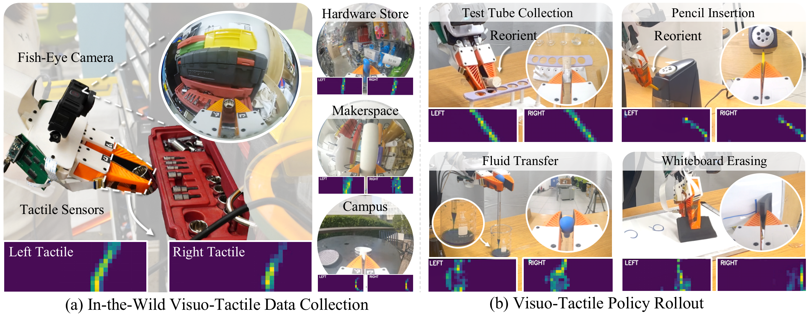

# Touch in the Wild: Learning Fine‑Grained Manipulation with a Portable Visuo‑Tactile Gripper

[\[Project page\]](https://binghao-huang.github.io/touch_in_the_wild/) · [\[Paper\]](https://binghao-huang.github.io/touch_in_the_wild/) · [\[ROS2 & Data Collection Tutorial\]](https://github.com/YolandaXinyueZhu/touch_in_the_wild-data-collection) 

</p>

[Xinyue Zhu](https://binghao-huang.github.io/touch_in_the_wild/)<sup>\* 1</sup>,
[Binghao Huang](https://binghao-huang.github.io/)<sup>\* 1</sup>,
[Yunzhu Li](https://yunzhuli.github.io/)<sup>1</sup>

<sup>\*</sup>Equal contribution <sup>1</sup>Columbia University


## 🛠️ Installation

> **Tested on Ubuntu 22.04**

1. **System dependencies & Docker**
   Follow the [Universal Manipulation Interface](https://github.com/real-stanford/universal_manipulation_interface) guide to install Docker and all required system packages.
2. **Conda environment**
   We recommend [Miniforge](https://github.com/conda-forge/miniforge) + *mamba* for faster solves.

   ```bash
   mamba env create -f conda_environment.yaml
   mamba activate touchwild
   ```


## 📍 Creating a Dataset with the SLAM Pipeline

The SLAM pipeline aligns GoPro videos with tactile logs and produces a time‑synchronised dataset.

1. **Collect data**
   Follow the [Touch‑in‑the‑Wild ROS 2 Guide](https://github.com/YolandaXinyueZhu/touch_in_the_wild-data-collection) to record GoPro streams **plus** tactile JSON logs.
   For detailed instructions on collecting demonstrations with the UMI gripper, see the [Data Collection Tutorial](https://swanky-sphere-ad1.notion.site/UMI-Data-Collection-Tutorial-4db1a1f0f2aa4a2e84d9742720428b4c?pvs=4).
2. **Organise files**
    Collect **all** videos recorded during the session—including

   * **demo videos**
   * **mapping videos**
   * **gripper calibration video**
   
   —and the associated tactile JSON file, and place everything in **one folder**:

   ````text
   <YOUR_SESSION_FOLDER>/
   ├── demo_mapping.mp4
   ├── demo_gripper.mp4
   ├── demo_0001.mp4
   ├── demo_0002.mp4
   └── tactile_recording_YYYYMMDD_HHMMSS.json
   ````

3. **Run the pipeline**

   ```bash
   (touchwild)$ python run_slam_pipeline.py <YOUR_SESSION_FOLDER> --bag <YOUR_SESSION_FOLDER>/tactile_recording_YYYYMMDD_HHMMSS.json
   ```
   All SLAM outputs are written back into `<YOUR_SESSION_FOLDER>/`.
   
5. **Generate training dataset**

   ```bash
   (touchwild)$ python scripts_slam_pipeline/07_generate_replay_buffer.py <YOUR_SESSION_FOLDER> -o <YOUR_SESSION_FOLDER>/dataset.zarr.zip
   ```

## 🖐️ Building a *visuo-tactile‑only* Dataset

`run_tactile_pipeline.py` builds a *visuo-tactile* dataset with the same Zarr layout as the full SLAM pipeline, but containing only GoPro and tactile images for self‑supervised MAE pre‑training.

```bash
(touchwild)$ python run_tactile_pipeline.py --bag /path/to/tactile_recording_YYYYMMDD_HHMMSS.json
```

Generate visuo-tactile-only training dataset:

```bash
(touchwild)$ python scripts_tactile_pipeline/04_generate_replay_buffer.py <YOUR_SESSION_FOLDER> -o <YOUR_SESSION_FOLDER>/dataset.zarr.zip
```

## 🧑‍🔬 Pre‑training the Visuo‑Tactile MAE

1. **Dataset** – use any `dataset.zarr.zip` created above.
2. **Launch training**

   ```bash
   (touchwild)$ python -m pretrain_mae.pretrain_mae task.dataset_path=/path/to/dataset.zarr.zip
   ```

   Checkpoints are stored in `pretrain_mae/pretrain_checkpoints/`.

### 🔍 Evaluate a checkpoint

We provide an example pretrained MAE checkpoint.

```bash
pip install -U "huggingface_hub[cli]"

huggingface-cli download \
    xinyue-zhu/pretrained_mae \
    pretrain_mae.pth \
    config.yaml \
    --repo-type model \
    --local-dir ./pretrain_checkpoints
```

To evaluate the pretrained checkpoint on the tactile reconstruction task:

```bash
(touchwild)$ python -m pretrain_mae.pretrain_eval --checkpoint /path/to/mae_checkpoint.pth --dataset /path/to/dataset.zarr.zip --plot_images    
```

The script reports Mean‑Squared‑Error (MSE) on the validation split and, with `--plot_images`, saves qualitative results to `eval_outputs/`.


## 📈 Training Diffusion Policies

We provide an example `test_tube_collection` dataset (\~13 GB).

```bash
pip install -U "huggingface_hub[cli]"

huggingface-cli download \
    xinyue-zhu/test_tube_collection \
    test_tube_collection.zarr.zip \
    --repo-type dataset \
    --local-dir ./dataset
```

### Single‑GPU

```bash
(touchwild)$ python train.py \
  --config-name train_diffusion_unet_timm_umi_workspace \
  task.dataset_path=/path/to/dataset.zarr.zip \
  policy.obs_encoder.use_tactile=true \
  policy.obs_encoder.tactile_model_choice=pretrain \
  policy.obs_encoder.pretrain_ckpt_path=/path/to/mae_checkpoint.pth
```

### Multi‑GPU

```bash
(touchwild)$ accelerate --num_processes <NGPUS> train.py \
  --config-name train_diffusion_unet_timm_umi_workspace \
  task.dataset_path=/path/to/dataset.zarr.zip \
  policy.obs_encoder.use_tactile=true \
  policy.obs_encoder.tactile_model_choice=pretrain \
  policy.obs_encoder.pretrain_ckpt_path=/path/to/mae_checkpoint.pth
```

## 🦾 Real‑World Deployment

Below we demonstrate deploying a trained policy on **xArm 850**.

### 🎥 Camera Setup

Refer to the [UMI Hardware Guide](https://github.com/real-stanford/universal_manipulation_interface?tab=readme-ov-file#-real-world-deployment) for GoPro configuration.

### 🖐️ Tactile Setup

1. Physically connect both tactile sensors to the machine running the policy.
2. Follow the [tactile hardware guide](https://github.com/YolandaXinyueZhu/TactileUMI_ros2/tree/main?tab=readme-ov-file#-tactile-hardware) to configure persistent port naming.

### 🤖 Robot Setup

#### Install the xArm Python SDK

```bash
# From outside the repository
(touchwild)$ cd ..
(touchwild)$ git clone https://github.com/xArm-Developer/xArm-Python-SDK.git
(touchwild)$ cd xArm-Python-SDK
(touchwild)$ pip install .
```

#### Launch uFactory Studio

1. Download **UFactoryStudio‑Linux‑1.0.1.AppImage** from the [uFactory website](https://www.ufactory.us/ufactory-studio).
3. Connect to the robot's IP address.
4. Go to Settings → Motion → TCP and set the payload to:

   * **Weight:** 1.9 kg
   * **Center of Mass (CoM):** x = -2 mm, y = -6 mm, z = 37 mm

5. Go to Settings → Motion → TCP and set the TCP offset to: `(x = 0 mm, y = 0 mm, z = 270 mm, roll = 0°, pitch = 0°, yaw = 90°)`

#### Configure IP

Edit the configuration file to set the robot's IP address:

```yaml
# File: /example/eval_robots_config.yaml
robot_ip: <your_robot_ip_here>
```

### ☕ Running a Policy

```bash
# Allow access to the HDMI capture card
sudo chmod -R 777 /dev/bus/usb

# Evaluate a checkpoint
(touchwild)$ python eval_real.py --robot_config example/eval_robots_config.yaml -i /path/to/policy_checkpoint.ckpt -o /path/to/output_folder

```
## 🖐️ Related Works

3D-ViTac: Learning Fine-Grained Manipulation with Visuo-Tactile Sensing. [link](https://binghao-huang.github.io/3D-ViTac/).

VT-Refine: Learning Bimanual Assembly with Visuo-Tactile Feedback via Simulation Fine-Tuning. [link](https://binghao-huang.github.io/vt_refine/)


## 🏷️ License

This project is released under the **MIT License**. See [LICENSE](LICENSE) for details.


## 🙏 Acknowledgements

Our Visuo-Tactile Gripper builds upon [UMI Gripper](https://umi-gripper.github.io/umi.pdf). The SLAM pipeline builds upon [Steffen Urban](https://github.com/urbste)’s fork of [ORB\_SLAM3](https://github.com/UZ-SLAMLab/ORB_SLAM3) and his [OpenImuCameraCalibrator](https://github.com/urbste/OpenImuCameraCalibrator/).

The gripper’s mechanical design is adapted from the [Push/Pull Gripper](https://www.thingiverse.com/thing:2204113) by [John Mulac](https://www.thingiverse.com/3dprintingworld/designs), and the soft finger from an original design by [Alex Alspach](http://alexalspach.com/) at TRI. The GoPro installation frame on robot side is adapted from [Fast-UMI](https://arxiv.org/abs/2409.19499).


